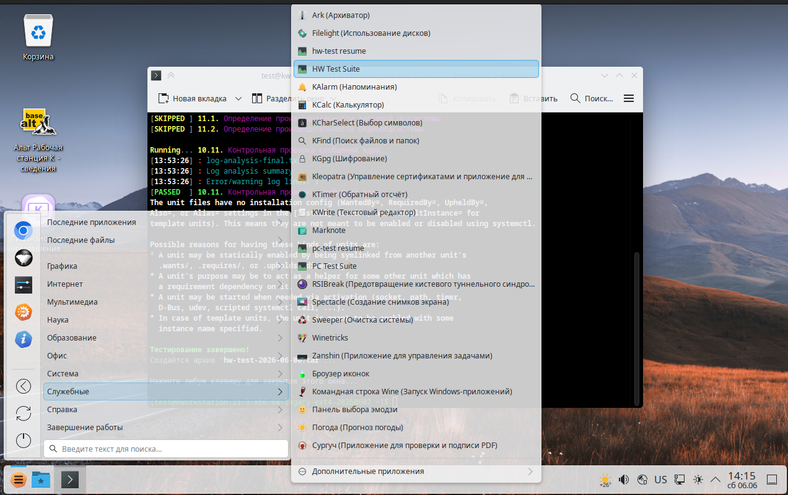
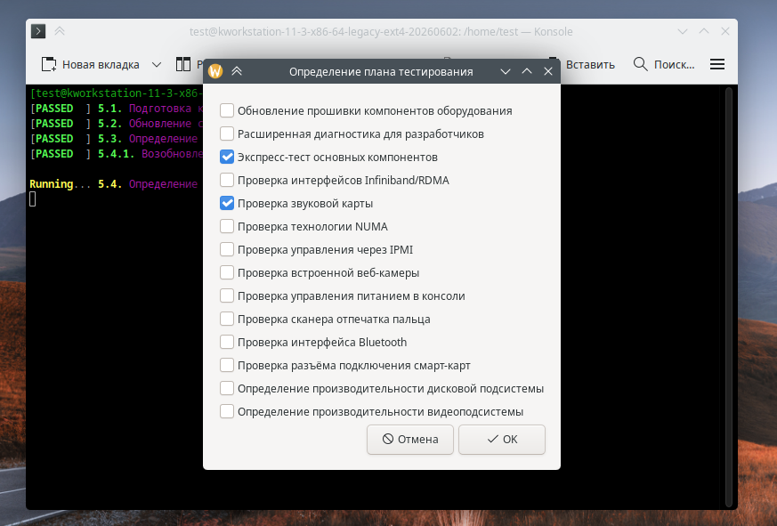
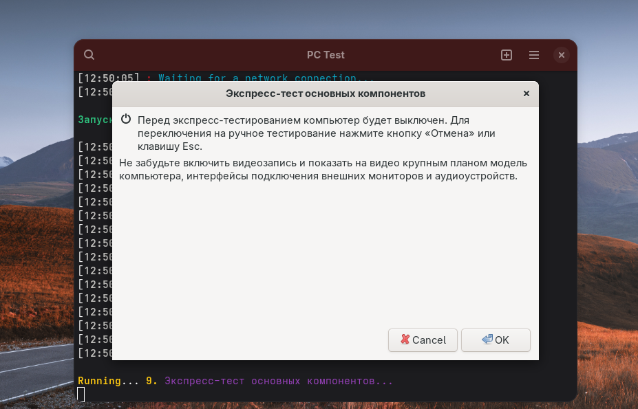
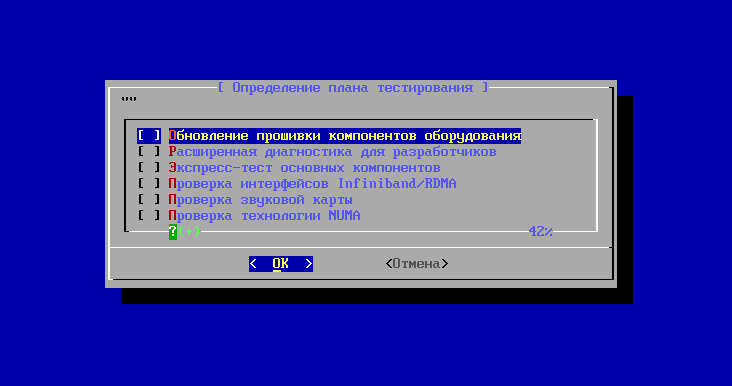

# Скриншоты

## Значок запуска в главном меню, Альт Рабочая станция К 11.3

## Определения плана тестирования, Альт Рабочая K станция релиз 11

## Предупреждение о начале экспресс-тестирования, Альт Рабочая K станция релиз 11

## Определения плана тестирования, Регулярная сборка на Сизифе

## Тестирование завершено, Регулярная сборка на Сизифе

